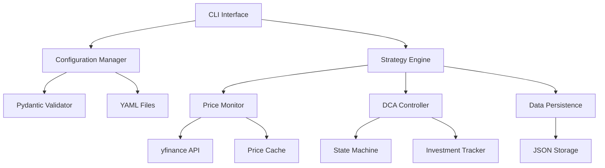

# Design Document: Buy the Dip Strategy

## Overview

The Buy the Dip Strategy system is a Python-based stock trading simulator that implements a dollar-cost averaging approach during market downturns. The system monitors configurable stock tickers (default SPY) and automatically triggers investment when prices drop below a threshold relative to recent highs, continuing until prices recover.

The architecture emphasizes modularity, configurability, and efficient data processing. Key design decisions include using pandas for time series operations, Pydantic for configuration validation, and a state machine pattern for managing multiple overlapping DCA periods.

## Architecture

The system follows a layered architecture with clear separation of concerns:



**Layer Responsibilities:**
- **Presentation Layer**: CLI interface for user interaction and configuration
- **Business Logic Layer**: Strategy engine orchestrating the trading logic
- **Data Layer**: Price monitoring, caching, and persistence
- **External Services**: yfinance API for market data

## Components and Interfaces

### Configuration Manager
**Purpose**: Load, validate, and manage YAML configuration files

**Key Methods:**
```python
class ConfigurationManager:
    def load_config(self, config_path: Optional[str] = None) -> StrategyConfig
    def validate_config(self, config: dict) -> StrategyConfig
    def get_default_config_path(self) -> str
```

**Configuration Schema** (using Pydantic):
```python
class StrategyConfig(BaseModel):
    ticker: str = "SPY"
    rolling_window_days: int = Field(90, ge=1, le=365)
    percentage_trigger: float = Field(0.90, gt=0.0, le=1.0)
    monthly_dca_amount: float = Field(2000.0, gt=0.0)
    data_cache_days: int = Field(30, ge=1)
```

### Price Monitor
**Purpose**: Fetch, cache, and analyze stock price data with efficient rolling maximum calculation

**Key Methods:**
```python
class PriceMonitor:
    def fetch_price_data(self, ticker: str, start_date: date, end_date: date) -> pd.DataFrame
    def get_rolling_maximum(self, prices: pd.Series, window: int) -> pd.Series
    def get_current_price(self, ticker: str) -> float  # Returns closing price
    def update_cache(self, ticker: str, new_data: pd.DataFrame) -> None
```

**Rolling Maximum Implementation**: Uses pandas rolling window operations on closing prices for efficiency, with fallback to numpy stride tricks for large datasets based on research findings.

### DCA Controller
**Purpose**: Manage dollar-cost averaging periods using a state machine pattern

**State Machine Design:**
```python
class DCAState(Enum):
    MONITORING = "monitoring"
    ACTIVE = "active"
    COMPLETED = "completed"

class DCASession:
    session_id: str
    trigger_price: float
    start_date: date
    state: DCAState
    total_invested: float
    shares_purchased: float
```

**Key Methods:**
```python
class DCAController:
    def check_trigger_conditions(self, current_price: float, max_price: float) -> bool
    def start_dca_session(self, trigger_price: float) -> str
    def process_monthly_investment(self, session_id: str, current_price: float) -> None
    def check_completion_conditions(self, session_id: str, current_price: float) -> bool
```

### Strategy Engine
**Purpose**: Orchestrate the overall trading strategy and coordinate between components

**Key Methods:**
```python
class StrategyEngine:
    def initialize(self, config: StrategyConfig) -> None
    def run_strategy(self) -> None
    def process_price_update(self, current_price: float) -> None
    def generate_report(self) -> StrategyReport
```

### CLI Interface
**Purpose**: Provide command-line interface for running strategies with different configurations

**Command Structure:**
```bash
python buy_the_dip.py [--config CONFIG_FILE] [--report] [--validate-config]
```

## Data Models

### Price Data Structure
```python
class PriceData:
    date: date
    close: float  # Using closing price for simplicity
    volume: int
```

### Investment Transaction
```python
class Transaction:
    transaction_id: str
    session_id: str
    date: date
    price: float
    shares: float
    amount: float
    transaction_type: Literal["buy"]
```

### Strategy State
```python
class StrategyState:
    config: StrategyConfig
    active_sessions: List[DCASession]
    completed_sessions: List[DCASession]
    all_transactions: List[Transaction]
    last_update: datetime
    price_cache: Dict[str, pd.DataFrame]
```

## Error Handling

**Price Data Errors:**
- Network failures: Retry with exponential backoff (max 3 attempts)
- Invalid ticker symbols: Log error and exit gracefully
- Missing historical data: Use available data with warnings

**Configuration Errors:**
- Invalid YAML syntax: Display clear error message with line numbers
- Missing required fields: Use defaults with warnings
- Out-of-range values: Validate using Pydantic constraints

**State Persistence Errors:**
- Corrupted state files: Initialize fresh state with backup of corrupted file
- Disk space issues: Log critical error and attempt cleanup
- Permission errors: Provide clear instructions for resolution

**Graceful Degradation:**
- Cache failures: Continue with fresh API calls
- Partial data: Operate with available data and log limitations
- API rate limits: Implement respectful backoff strategies

## Testing Strategy

The testing approach combines unit tests for specific functionality with property-based tests for universal correctness guarantees.

**Unit Testing Focus:**
- Configuration validation edge cases
- Price data parsing and error conditions
- State machine transitions
- CLI argument processing
- Integration between components

**Property-Based Testing Configuration:**
- Framework: Hypothesis (Python's leading PBT library)
- Minimum iterations: 100 per property test
- Test tagging format: `# Feature: buy-the-dip-strategy, Property {N}: {description}`

**Test Organization:**
```
tests/
├── unit/
│   ├── test_config_manager.py
│   ├── test_price_monitor.py
│   ├── test_dca_controller.py
│   └── test_strategy_engine.py
├── property/
│   ├── test_rolling_maximum_properties.py
│   ├── test_dca_session_properties.py
│   └── test_state_persistence_properties.py
└── integration/
    ├── test_end_to_end_scenarios.py
    └── test_cli_interface.py
```

**Performance Testing:**
- Rolling window calculations with large datasets (1M+ data points)
- Memory usage during extended monitoring periods
- Configuration loading and validation speed

## Correctness Properties

*A property is a characteristic or behavior that should hold true across all valid executions of a system—essentially, a formal statement about what the system should do. Properties serve as the bridge between human-readable specifications and machine-verifiable correctness guarantees.*

Based on the prework analysis and property reflection to eliminate redundancy, the following properties ensure the system behaves correctly across all valid inputs and scenarios:

### Property 1: Price Data Retrieval Consistency
*For any* valid date range and ticker symbol, requesting price data should return daily closing prices for all trading days within that range, and repeated requests for the same range should return identical data.
**Validates: Requirements 1.2, 1.4**

### Property 2: Rolling Maximum Correctness
*For any* price series and window size, the rolling maximum at each position should equal the maximum value in the window ending at that position, and adding new data points should maintain this correctness efficiently.
**Validates: Requirements 2.1, 2.3**

### Property 3: Configuration Validation Consistency
*For any* configuration values, the validation should accept values within defined ranges and reject values outside those ranges, with consistent behavior across all configuration parameters.
**Validates: Requirements 6.7**

### Property 4: Trigger Detection Accuracy
*For any* price sequence and trigger percentage, when the current price drops below (rolling_maximum * percentage_trigger), the system should activate DCA, and should continuously check this condition on every price update.
**Validates: Requirements 3.1, 3.3**

### Property 5: Configuration Change Propagation
*For any* configuration parameter change, all subsequent calculations should use the new values while not affecting already active DCA sessions.
**Validates: Requirements 2.2, 3.2, 4.2**

### Property 6: DCA Investment Consistency
*For any* active DCA session, monthly investments should occur at the configured rate using the correct closing price, and all investments should be properly tracked with accurate totals.
**Validates: Requirements 4.1, 4.3, 4.4, 8.1**

### Property 7: DCA Session Lifecycle
*For any* DCA session, it should activate when price drops below trigger, continue until price reaches or exceeds the original trigger price, then deactivate while maintaining independent state from other sessions.
**Validates: Requirements 5.1, 5.2, 5.3**

### Property 8: Dynamic Trigger Updates
*For any* sequence of price updates, when the rolling maximum increases, future trigger calculations should use the new maximum while existing DCA sessions maintain their original trigger prices.
**Validates: Requirements 5.4**

### Property 9: Portfolio Calculation Accuracy
*For any* set of investment transactions and current price, the total invested amount, total shares owned, current portfolio value, and performance metrics should be calculated correctly and consistently.
**Validates: Requirements 8.2, 8.3, 8.4**

### Property 10: State Persistence Round-Trip
*For any* valid system state, saving the state and then restoring it should produce an equivalent state, and transactions should be persisted immediately when they occur.
**Validates: Requirements 9.1, 9.2, 9.3**