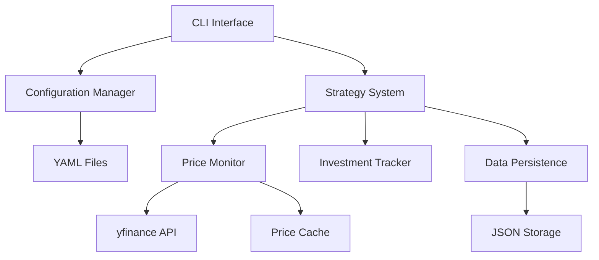

# Design Document: Buy the Dip Strategy

## Overview

The Buy the Dip Strategy system is a Python-based stock trading simulator that implements a simplified daily evaluation approach. Each trading day, the system calculates a trigger price based on recent highs and checks if yesterday's closing price was at or below this trigger. When conditions are met and no investment has occurred in the past 28 days, it executes a buy at the current day's closing price.

The architecture emphasizes simplicity and statelessness, with the only persistent state being the investment history needed to enforce the 28-day constraint. The system processes each trading day independently, making it easy to understand, test, and maintain.

## Architecture

The system follows a simple layered architecture:



**Layer Responsibilities:**
- **CLI Layer**: Command-line interface and configuration loading
- **Strategy Layer**: Daily evaluation logic and investment decisions
- **Data Layer**: Price fetching, caching, and investment persistence

## Components and Interfaces

### Configuration Managerv
**Purpose**: Load and validate YAML configuration files

**Key Methods:**
```python
class ConfigurationManager:
    def load_config(self, config_path: Optional[str] = None) -> StrategyConfig
    def validate_config(self, config: dict) -> StrategyConfig
```

**Configuration Schema** (using Pydantic):
```python
class StrategyConfig(BaseModel):
    ticker: str = "SPY"
    rolling_window_days: int = Field(90, ge=1)
    percentage_trigger: float = Field(0.90, gt=0.0, le=1.0)
    monthly_dca_amount: float = Field(2000.0, gt=0.0)
    data_cache_days: int = Field(30, ge=1)
```

### Price Monitor
**Purpose**: Fetch, cache, and provide stock price data

**Key Methods:**
```python
class PriceMonitor:
    def get_closing_prices(self, ticker: str, start_date: date, end_date: date) -> pd.Series
    def get_latest_closing_price(self, ticker: str) -> float
    def calculate_rolling_maximum(self, prices: pd.Series, window_days: int) -> float
    def is_cache_valid(self, ticker: str) -> bool
    def update_cache(self, ticker: str, prices: pd.Series) -> None
```

**Caching Strategy**: Simple file-based caching with configurable expiration. Cache files are stored as CSV with ticker symbol and date range in filename.

### Investment Tracker
**Purpose**: Manage investment history and enforce 28-day constraint

**Key Methods:**
```python
class InvestmentTracker:
    def add_investment(self, investment: Investment) -> None
    def has_recent_investment(self, check_date: date, days: int = 28) -> bool
    def get_all_investments(self) -> List[Investment]
    def calculate_portfolio_metrics(self, current_price: float) -> PortfolioMetrics
    def save_to_file(self, filepath: str) -> None
    def load_from_file(self, filepath: str) -> None
```

### Strategy System
**Purpose**: Orchestrate daily evaluation and investment decisions

**Key Methods:**
```python
class StrategySystem:
    def evaluate_trading_day(self, evaluation_date: date) -> EvaluationResult
    def calculate_trigger_price(self, prices: pd.Series, window_days: int, trigger_pct: float) -> float
    def should_invest(self, yesterday_price: float, trigger_price: float, evaluation_date: date) -> bool
    def execute_investment(self, evaluation_date: date, closing_price: float, amount: float) -> Investment
    def run_backtest(self, start_date: date, end_date: date) -> BacktestResult
```

**Daily Evaluation Logic:**
1. Fetch price data for rolling window + 1 day (to get yesterday's price)
2. Calculate rolling maximum over window days (excluding current day)
3. Calculate trigger price = rolling_maximum * percentage_trigger
4. Check if yesterday's closing price <= trigger_price
5. Check if any investment made in past 28 days
6. If both conditions met, execute investment at current day's closing price

## Data Models

### Investment Record
```python
class Investment:
    date: date
    ticker: str
    price: float  # Closing price on investment date
    amount: float  # Dollar amount invested
    shares: float  # Calculated as amount / price
```

### Portfolio Metrics
```python
class PortfolioMetrics:
    total_invested: float
    total_shares: float
    current_value: float  # total_shares * current_price
    total_return: float   # current_value - total_invested
    percentage_return: float  # total_return / total_invested
```

### Evaluation Result
```python
class EvaluationResult:
    evaluation_date: date
    yesterday_price: float
    trigger_price: float
    rolling_maximum: float
    trigger_met: bool
    recent_investment_exists: bool
    investment_executed: bool
    investment: Optional[Investment]
```

### Backtest Result
```python
class BacktestResult:
    start_date: date
    end_date: date
    total_evaluations: int
    trigger_conditions_met: int
    investments_executed: int
    investments_blocked_by_constraint: int
    final_portfolio: PortfolioMetrics
    all_investments: List[Investment]
```

## Error Handling

**Price Data Errors:**
- Network failures: Retry with exponential backoff (max 3 attempts)
- Invalid ticker symbols: Log error and exit gracefully
- Missing price data: Skip evaluation for that day with warning

**Configuration Errors:**
- Invalid YAML: Display clear error message and exit
- Missing required fields: Use defaults with warnings
- Out-of-range values: Validate using Pydantic and reject invalid configs

**28-Day Constraint Implementation:**
- Investment on Day 0 (e.g., Wednesday) blocks investments on Days 1-27
- Investment allowed again on Day 28 (next Wednesday, 4 weeks later)
- This creates a same-weekday investment pattern while maintaining proper spacing
- Implementation uses `investment.date > cutoff_date` where `cutoff_date = check_date - timedelta(days=28)`

**File System Errors:**
- Missing investment history: Start with empty history
- Corrupted investment file: Backup corrupted file and start fresh
- Permission errors: Provide clear error message with resolution steps

## Correctness Properties

*A property is a characteristic or behavior that should hold true across all valid executions of a system—essentially, a formal statement about what the system should do. Properties serve as the bridge between human-readable specifications and machine-verifiable correctness guarantees.*

### Property 1: Configuration Loading and Validation Consistency
*For any* YAML configuration file with valid structure, all required fields (ticker, rolling_window_days, percentage_trigger, monthly_dca_amount, data_cache_days) should be loaded correctly, and validation should accept values within defined ranges while rejecting values outside those ranges.
**Validates: Requirements 1.1, 1.2, 1.3, 1.4, 1.5, 1.7, 1.8, 1.9**

### Property 2: Price Data Caching Correctness
*For any* ticker and date range, when data is cached and still valid, repeated requests should return identical price data without additional API calls, and cache expiration should work correctly.
**Validates: Requirements 2.2, 2.3**

### Property 3: Trigger Price Calculation Accuracy
*For any* price series, window size, and percentage trigger, the system should calculate the rolling maximum over trailing window days using only closing prices, then compute trigger price as rolling_maximum * percentage_trigger, recalculating fresh each day.
**Validates: Requirements 3.1, 3.2, 3.3, 3.4**

### Property 4: Investment Decision Logic Correctness
*For any* trading day evaluation, an investment should be executed if and only if yesterday's closing price is <= trigger price AND no investment exists within the past 27 calendar days (allowing same weekday pattern with 28-day spacing), with each day evaluated independently.
**Validates: Requirements 4.1, 4.2, 4.3, 4.6**

### Property 5: Investment Constraint Enforcement
*For any* sequence of investment attempts over time, the system should never allow two investments within 27 calendar days of each other (allowing investments exactly 28 days apart for same weekday pattern), maintaining this as an invariant across all operations and using calendar days (not trading days).
**Validates: Requirements 5.1, 5.2, 5.3, 5.4, 5.5, 5.6**

### Property 6: Investment Execution and Recording Accuracy
*For any* executed investment, the system should use the current day's closing price, invest exactly the monthly_dca_amount, and accurately record the date, price, amount, and calculated shares (amount/price).
**Validates: Requirements 4.4, 4.5, 6.1, 6.2, 6.3, 6.4**

### Property 7: Portfolio Calculation Correctness
*For any* set of investments and current price, the calculated metrics should accurately reflect total invested (sum of amounts), total shares (sum of shares), current value (total_shares * current_price), total return (current_value - total_invested), and percentage return (total_return / total_invested).
**Validates: Requirements 8.1, 8.2, 8.3, 8.4, 8.5**

### Property 8: Investment Persistence Round-Trip
*For any* investment history, saving to file and then loading should produce an equivalent investment list, with immediate persistence on investment execution and proper constraint checking using persisted data across sessions.
**Validates: Requirements 7.1, 7.2, 7.3**

## Testing Strategy

The testing approach combines unit tests for specific functionality with property-based tests for universal correctness guarantees.

**Unit Testing Focus:**
- Configuration validation edge cases
- Price data error handling
- Investment constraint boundary conditions
- File persistence error scenarios
- CLI argument processing

**Property-Based Testing Configuration:**
- Framework: Hypothesis (Python's leading PBT library)
- Minimum iterations: 100 per property test
- Test tagging format: `# Feature: buy-the-dip-strategy, Property {N}: {description}`

**Test Organization:**
```
tests/
├── unit/
│   ├── test_config_manager.py
│   ├── test_price_monitor.py
│   ├── test_investment_tracker.py
│   └── test_strategy_system.py
├── property/
│   ├── test_trigger_calculation_properties.py
│   ├── test_investment_constraint_properties.py
│   └── test_portfolio_calculation_properties.py
└── integration/
    ├── test_daily_evaluation.py
    └── test_backtest_scenarios.py
```

**Dual Testing Approach:**
- Unit tests verify specific examples, edge cases, and error conditions
- Property tests verify universal properties across all inputs
- Both are complementary and necessary for comprehensive coverage
- Property tests handle covering lots of inputs while unit tests focus on concrete scenarios