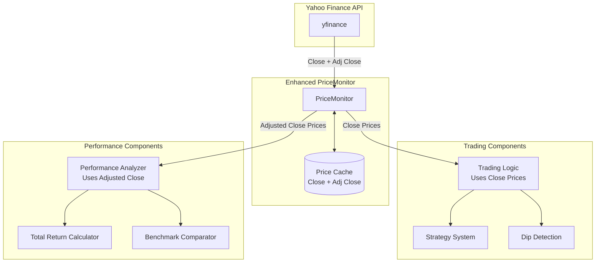

# Design Document

## Overview

The dual price system enhancement extends the existing PriceMonitor to support both Close and Adjusted Close prices from Yahoo Finance. This architectural change enables accurate trading decisions (using Close prices for real market movements) while providing fair performance analysis (using Adjusted Close prices that account for dividends and corporate actions).

The design maintains backward compatibility with existing trading logic while adding new capabilities for comprehensive performance analysis and benchmarking.

## Architecture

### Current Architecture
The existing system uses a single price column (Close) throughout:
- PriceMonitor fetches only Close prices
- Cache stores only Close prices  
- All calculations use Close prices

### Enhanced Architecture
The dual price system extends this to support both price types:
- PriceMonitor fetches both Close and Adjusted Close prices
- Cache stores both price columns with clear identification
- Trading logic continues using Close prices (no changes)
- New performance analysis components use Adjusted Close prices



## Components and Interfaces

### Enhanced PriceMonitor Class

The PriceMonitor class will be extended with dual price support while maintaining backward compatibility.

#### New Methods

```python
# Explicit price type methods
def get_closing_prices_for_trading(self, ticker: str, start_date: date, end_date: date) -> pd.Series:
    """Get Close prices for trading decisions."""
    
def get_adjusted_closing_prices(self, ticker: str, start_date: date, end_date: date) -> pd.Series:
    """Get Adjusted Close prices for performance analysis."""
    
def fetch_dual_price_data(self, ticker: str, start_date: date, end_date: date) -> pd.DataFrame:
    """Fetch both Close and Adjusted Close prices."""
    
def get_current_adjusted_price(self, ticker: str) -> float:
    """Get current Adjusted Close price."""
```

#### Modified Methods

```python
def fetch_price_data(self, ticker: str, start_date: date, end_date: date) -> pd.DataFrame:
    """Enhanced to fetch both Close and Adj Close columns."""
    
def _fetch_fresh_data(self, ticker: str, start_date: date, end_date: date) -> pd.DataFrame:
    """Enhanced to fetch both price types from API."""
```

#### Backward Compatibility

All existing methods maintain their current behavior:
- `get_closing_prices()` continues to return Close prices
- `get_current_price()` continues to return Close price
- `get_latest_closing_price()` continues to return Close price

### Performance Analysis Component

New component for calculating returns using Adjusted Close prices.

```python
class PerformanceAnalyzer:
    """Analyzes investment performance using total return calculations."""
    
    def __init__(self, price_monitor: PriceMonitor):
        self.price_monitor = price_monitor
    
    def calculate_total_return(self, ticker: str, start_date: date, end_date: date) -> float:
        """Calculate total return including dividends using Adjusted Close."""
        
    def calculate_price_return(self, ticker: str, start_date: date, end_date: date) -> float:
        """Calculate price-only return using Close prices."""
        
    def compare_to_benchmark(self, ticker: str, benchmark: str, start_date: date, end_date: date) -> Dict:
        """Compare total returns between ticker and benchmark."""
        
    def get_annualized_return(self, ticker: str, start_date: date, end_date: date) -> float:
        """Calculate annualized total return."""
```

## Data Models

### Enhanced Price Data Structure

The cache will store both price types in a unified structure:

```python
# Cache DataFrame structure
{
    "Date": [date objects],
    "Close": [float values],      # For trading decisions
    "Adj Close": [float values]   # For performance analysis
}
```

### Cache File Format

Enhanced JSON cache format with backward compatibility:

```json
{
    "ticker": "SPY",
    "last_updated": "2026-01-06T10:30:00",
    "format_version": "2.0",
    "prices": [
        {
            "Date": "2026-01-01",
            "Close": 150.25,
            "Adj Close": 148.75
        }
    ]
}
```

Legacy cache files (format_version missing or 1.0) contain only Close prices and will be automatically migrated.

### Migration Strategy

The system will handle three cache states:

1. **New Cache**: Contains both Close and Adj Close columns
2. **Legacy Cache**: Contains only Close column - will be enhanced with Adj Close data
3. **No Cache**: Fresh fetch will retrieve both price types

```python
def _load_cached_data(self, ticker: str) -> Optional[pd.DataFrame]:
    """Load cached data and handle migration."""
    data = self._load_cached_data_raw(ticker)
    
    if data is not None and "Adj Close" not in data.columns:
        # Legacy cache - needs migration
        data = self._migrate_legacy_cache(ticker, data)
    
    return data
```

## Error Handling

### API Failure Scenarios

1. **Partial Data Availability**: If only Close or only Adj Close is available, fetch what's possible and log the limitation
2. **Network Failures**: Graceful degradation - use cached data if available
3. **Invalid Ticker**: Clear error messages distinguishing between network issues and invalid symbols

### Cache Migration Errors

1. **Migration Failure**: If Adj Close data cannot be fetched during migration, continue with Close-only data and log warning
2. **Corrupted Cache**: Detect and rebuild cache files that are malformed
3. **Permission Errors**: Handle read-only cache directories gracefully

### Data Consistency

1. **Date Alignment**: Ensure Close and Adj Close data align on the same dates
2. **Missing Data**: Handle cases where one price type has data but the other doesn't
3. **Validation**: Verify that Adj Close ≤ Close (adjusted prices should not exceed raw prices)

## Testing Strategy

### Unit Testing Approach

**Existing Tests**: All current PriceMonitor tests continue to pass without modification, ensuring backward compatibility.

**New Tests**: Focus on dual price functionality:
- Dual price fetching from API
- Cache storage and retrieval of both price types
- Legacy cache migration
- Performance analysis calculations
- Error handling for partial data scenarios

**Test Categories**:
1. **Integration Tests**: End-to-end testing with real Yahoo Finance data
2. **Unit Tests**: Mock-based testing of individual components
3. **Migration Tests**: Verify smooth transition from legacy cache format
4. **Performance Tests**: Ensure dual price system doesn't significantly impact performance

### Property-Based Testing

Property-based tests will validate the mathematical relationships and data consistency requirements of the dual price system.

## Correctness Properties

*A property is a characteristic or behavior that should hold true across all valid executions of a system-essentially, a formal statement about what the system should do. Properties serve as the bridge between human-readable specifications and machine-verifiable correctness guarantees.*

### Property 1: Dual Price API Fetching
*For any* valid ticker and date range, when fetching price data from Yahoo Finance, the returned DataFrame should contain both "Close" and "Adj Close" columns with matching dates
**Validates: Requirements 1.1**

### Property 2: Dual Price Cache Storage  
*For any* ticker and price data containing both Close and Adjusted Close prices, when saving to cache, the cached data should contain both price columns with all original data preserved
**Validates: Requirements 1.2, 5.1**

### Property 3: Cache Data Merging Consistency
*For any* cached data and new data both containing Close and Adjusted Close columns, merging should preserve both price types and handle date-based deduplication correctly for both columns
**Validates: Requirements 1.4**

### Property 4: Legacy Cache Migration
*For any* legacy cache file containing only Close prices, loading should trigger migration to fetch missing Adjusted Close data while preserving all existing Close data
**Validates: Requirements 1.5, 5.3, 8.1, 8.3**

### Property 5: Trading Logic Price Type Consistency
*For any* trading operation (trigger calculation, rolling maximum, current price, buy condition evaluation), the system should use Close prices exclusively, never Adjusted Close prices
**Validates: Requirements 2.1, 2.2, 2.3, 2.4**

### Property 6: Performance Analysis Price Type Consistency  
*For any* performance analysis operation (total return, benchmark comparison, annualized return), the system should use Adjusted Close prices exclusively, never Close prices
**Validates: Requirements 3.1, 3.2, 3.3**

### Property 7: Method Price Type Separation
*For any* price retrieval method, methods designated for trading should return Close prices, methods designated for analysis should return Adjusted Close prices, and the method names should clearly indicate the price type
**Validates: Requirements 4.1, 4.2, 4.3**

### Property 8: Backward Compatibility Preservation
*For any* existing method call or configuration, the system should produce identical results to the pre-enhancement version when using trading functionality
**Validates: Requirements 4.4, 7.3, 7.4**

### Property 9: Cache Format Compatibility
*For any* existing cache file from previous system versions, the system should successfully load the data and enhance it with Adjusted Close prices without data loss
**Validates: Requirements 5.4, 8.4**

### Property 10: Performance Reporting Completeness
*For any* performance report request, the output should include both price return (using Close prices) and total return (using Adjusted Close prices) with clear identification of which includes dividend effects
**Validates: Requirements 6.1, 6.5**

### Property 11: Migration Transparency
*For any* migration operation from legacy cache to dual price cache, the process should complete automatically without user intervention and generate appropriate log messages
**Validates: Requirements 8.4, 8.5**

### Property 12: Data Consistency Validation
*For any* date where both Close and Adjusted Close prices exist, the Adjusted Close price should be less than or equal to the Close price (accounting for dividend adjustments)
**Validates: Data integrity requirement**

### Property 13: Cache Storage Optimization
*For any* cache storage operation, the system should store both price types efficiently without unnecessary data duplication while maintaining fast retrieval performance
**Validates: Requirements 5.5**