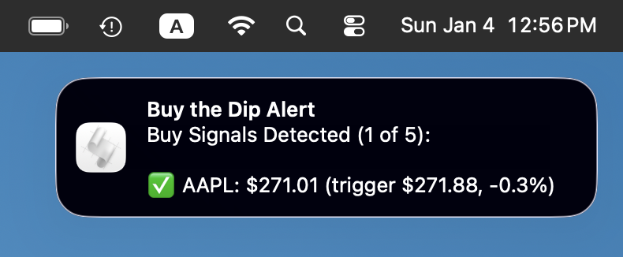

# Buy the Dip Strategy

[](https://github.com/nickaustinlee/buy_the_dip_strategy_simulator/actions/workflows/test-compatibility.yml)
[](https://www.python.org/downloads/)
[](https://opensource.org/licenses/MIT)
[](https://github.com/psf/black)
[](https://hypothesis.readthedocs.io/)
[](https://github.com/nickaustinlee/buy_the_dip_strategy_simulator)

A Python-based stock trading strategy simulator that implements a simplified "buy the dip" approach. The system evaluates each trading day independently, checking if yesterday's closing price dropped below a dynamically calculated trigger price. When conditions are met and no investment has been made in the past 28 days (configurable), it executes a buy at the current day's closing price.

## 🚀 Key Features

- **Automated Buy Signal Alerts**: Get macOS notifications with timestamps when buy signals are detected - perfect for daily cron jobs
- **Multi-Ticker Buy Signal Check**: Instantly compare buy signals across multiple tickers to prioritize investments
- **Latest Closing Price Mode**: Use `--latest-closing-price` flag for evening decision-making with today's closing price
- **Simplified Daily Evaluation**: Clean, stateless daily evaluation logic - no complex session management
- **Configurable Investment Spacing**: Customize minimum days between investments (1=daily, 7=weekly, 28=monthly) via config or CLI
- **Configurable Strategy Parameters**: Customize ticker, rolling window, trigger percentage, and investment amount via YAML
- **Intelligent Price Monitoring**: Real-time price data fetching with smart caching and validation
- **Calendar vs Trading Days**: Choose between calendar days (default, intuitive) or trading days for rolling window calculations
- **Comprehensive Testing**: 228 tests including property-based testing for universal correctness guarantees
- **Robust CLI Interface**: Full-featured command-line interface with backtesting and reporting
- **Performance Analysis**: Portfolio metrics and performance tracking with buy-and-hold comparison
- **Production Ready**: Thoroughly tested with comprehensive error handling

## 🎯 How It Works

The strategy follows a simple daily evaluation process:

1. **Calculate Trigger Price**: `rolling_maximum * percentage_trigger` (e.g., 90% of 90-day high)
2. **Check Yesterday's Price**: Did it drop to or below the trigger price?
3. **Enforce Investment Spacing**: Has it been at least the configured minimum days since the last investment?
4. **Execute Investment**: If both conditions are met, invest the configured amount

**Example**: If SPY's 90-day high is $500 and your trigger is 90%, the system will invest when the price drops to $450 or below (assuming no recent investments within your configured spacing period).

## 📦 Installation

### Quick Start
New to the project? Check out the [Quick Start Guide](QUICKSTART.md) for a 5-minute setup and first run.

### Prerequisites
- Python 3.13 or higher
- Poetry (recommended) or pip

### Using Poetry (Recommended)

```bash
# Clone the repository
git clone <repository-url>
cd buy-the-dip-strategy

# Install Poetry if needed
curl -sSL https://install.python-poetry.org | python3 -

# Install dependencies
poetry install
```

### Using pip

```bash
# Clone and setup
git clone <repository-url>
cd buy-the-dip-strategy
python -m venv venv
source venv/bin/activate  # Windows: venv\Scripts\activate
pip install -r requirements.txt
pip install -e .
```

For detailed installation instructions, see [INSTALLATION.md](INSTALLATION.md).

## 🎯 Quick Start

> **Note:** All examples use `poetry run buy-the-dip`. If you're using pip/venv instead of Poetry, replace `poetry run buy-the-dip` with `python buy_the_dip.py` in all commands.

### Run with Default Configuration
```bash
poetry run buy-the-dip
```

This monitors SPY with a 90-day rolling window, triggers on 10% drops, and simulates $1,000 monthly investments.

### Run a Backtest
```bash
# Backtest the last year
poetry run buy-the-dip --backtest --period 1y

# Backtest specific date range
poetry run buy-the-dip --backtest --start-date 2023-01-01 --end-date 2023-12-31
```

### Check Current Status
```bash
# Show current portfolio status
poetry run buy-the-dip --status

# Evaluate a specific date
poetry run buy-the-dip --evaluate 2024-01-15
```

## 📋 Usage Examples

For comprehensive usage examples, see [EXAMPLES.md](EXAMPLES.md).

### Quick Buy Signal Check (Multi-Ticker) with --check flag

**The fastest way to check which tickers have buy signals right now:**

```bash
# Check multiple tickers at once
poetry run buy-the-dip --tickers QQQ SPY AAPL VTI BND \
  --check \
  --rolling-window 30 \
  --trigger-pct 0.95
```
**Output:**
```
🔍 MULTI-TICKER BUY SIGNAL CHECK (2026-01-04)
================================================================================

Ticker   Closing      Trigger      Signal   % from Trigger 
--------------------------------------------------------------------------------
QQQ      $613.12      $595.46      ❌ NO     +3.0%          
SPY      $683.17      $655.86      ❌ NO     +4.2%          
AAPL     $271.01      $271.88      ✅ BUY    -0.3%          
VTI      $336.31      $322.89      ❌ NO     +4.2%          
BND      $74.04       $70.69       ❌ NO     +4.7%          

Summary: ✅ 1 of 5 tickers have buy signals
```

**Use Case**: "I have money to invest today. Which of my favorite tickers are showing buy signals according to the buy-the-dip strategy?"

This helps you prioritize which ticker to invest in when you have capital available. The check ignores the 28-day constraint and simply tells you which tickers are currently at attractive entry points based on your strategy parameters.

**Note:** For consistent behavior, the program uses the prior trading day's closing price by default. If you want to use today's closing price (e.g., running after 4:00 PM ET and using today's close), use the `--latest-closing-price` flag:

```bash
poetry run buy-the-dip --tickers AAPL MSFT \
   --check \
   --rolling-window 60 \
   --trigger-pct 0.95 \
   --latest-closing-price
```

### Automated Buy Signal Alerts (macOS)

**Get notified automatically when buy signals are detected:**

```bash
# Add --notify flag to get macOS notifications
poetry run buy-the-dip --tickers QQQ SPY AAPL VTI BND \
  --check \
  --rolling-window 30 \
  --trigger-pct 0.95 \
  --notify
```

**Notification shows:**
```
Buy Signals Detected (1 of 5):

✅ AAPL: $271.01 (trigger $271.88, -0.3%)

TS: January 6, 2026 @ 1:05 PM Local
```



**Set up daily automated alerts with cron:**

1. **Create a check script** (`~/check_buy_signals.sh`):
```bash
#!/bin/bash
cd /path/to/buy-the-dip
/usr/local/bin/poetry run buy-the-dip \
  --tickers QQQ SPY AAPL VTI BND \
  --check \
  --rolling-window 30 \
  --trigger-pct 0.95 \
  --notify
```

2. **Make it executable**:
```bash
chmod +x ~/check_buy_signals.sh
```

3. **Add to crontab** (runs weekdays at 5 PM after market close):
```bash
# Edit crontab
crontab -e

# Add this line (replace /path/to with your actual path):
0 17 * * 1-5 /Users/yourusername/check_buy_signals.sh
```

4. **Test it manually**:
```bash
~/check_buy_signals.sh
```

**How it works:**
- Runs automatically every weekday at 5 PM (after market close)
- Checks all your tickers for buy signals
- Sends macOS notification only when buy signals are detected
- No terminal needs to be open - runs in background
- Notification shows which tickers have signals with prices and timestamps
- Timestamp shows exactly when the report ran (helpful for cron jobs)

**Customize the schedule:**
- `0 17 * * 1-5` = 5:00 PM, Monday-Friday
- `30 16 * * 1-5` = 4:30 PM, Monday-Friday
- `0 9 * * 1-5` = 9:00 AM, Monday-Friday
- `5 13 * * 1-5` = 1:05 PM, Monday-Friday (Pacific Time - after market close)

**For Pacific Time users:**
If you're in Pacific Time, the market closes at 1:00 PM, so running at 1:05 PM ensures you get the final closing prices:
```bash
# Edit crontab
crontab -e

# Add this line for 1:05 PM Pacific, Monday-Friday:
5 13 * * 1-5 /Users/yourusername/check_buy_signals.sh
```

**Note**: macOS notifications only work when your Mac is awake. Consider adjusting your Energy Saver settings or using `pmset` to wake your Mac for the cron job if needed.

### Single Ticker Check

```bash
# Check if a single ticker has a buy signal today
poetry run buy-the-dip --config config.yaml --check

# With notifications
poetry run buy-the-dip --config config.yaml --check --notify

# Use latest closing price for evening decision-making
poetry run buy-the-dip --config config.yaml --check --latest-closing-price --notify
```

### Latest Closing Price Mode

**For evening decision-making after market close:**

The `--latest-closing-price` flag allows you to use today's closing price instead of the last trading day's price. This is perfect for making investment decisions in the evening after the market has closed.

```bash
# Default behavior (uses last trading day's closing price)
poetry run buy-the-dip --config config.yaml --check

# Evening mode (uses today's closing price if available)
poetry run buy-the-dip --config config.yaml --check --latest-closing-price
```

**Key differences:**
- **Default mode**: Always uses the last trading day's closing price (consistent regardless of when you run it)
- **Latest closing price mode**: Uses today's closing price if available, errors if not yet available

**Example output with latest closing price:**
```
🔍 BUY SIGNAL CHECK - SPY (2026-01-06)
==================================================
Closing Price: $445.20
Trigger Price: $450.00
Rolling Maximum (90d): $500.00
Trigger Percentage: 90.0%

✅ BUY SIGNAL: Trigger condition is met!
   Closing price ($445.20) is at or below
   the trigger price ($450.00)
```

**Error handling:**
If you run with `--latest-closing-price` but today's closing price isn't available yet:
```
ERROR - Today's closing price not available for SPY. Yahoo Finance may not have updated yet - please try again later.
```

**Multi-ticker support:**
```bash
# Check multiple tickers with latest closing prices
poetry run buy-the-dip --tickers QQQ SPY AAPL \
  --check \
  --rolling-window 30 \
  --trigger-pct 0.95 \
  --latest-closing-price \
  --notify
```

### Basic Commands

```bash
# Run with custom configuration
poetry run buy-the-dip --config my_config.yaml

# Validate configuration without running
poetry run buy-the-dip --config my_config.yaml --validate-config

# Run backtest with different periods
poetry run buy-the-dip --backtest --period 6m    # 6 months
poetry run buy-the-dip --backtest --period 90d   # 90 days
poetry run buy-the-dip --backtest --period 2y    # 2 years
```

### Advanced Options

```bash
# Use custom investment spacing
poetry run buy-the-dip --min-days-between 7 --backtest  # Weekly investments
poetry run buy-the-dip --min-days-between 1 --backtest  # Daily investments

# Check multiple tickers with custom spacing
poetry run buy-the-dip --tickers QQQ SPY AAPL \
  --check \
  --rolling-window 60 \
  --trigger-pct 0.95 \
  --min-days-between 14  # Bi-weekly spacing

# Use trading days instead of calendar days for rolling window
poetry run buy-the-dip --count-trading-days --backtest

# Combine custom spacing with trading days
poetry run buy-the-dip --min-days-between 7 --count-trading-days --backtest

# Force fresh data (ignore cache)
poetry run buy-the-dip --ignore-cache --backtest
```

### Investment Spacing Configuration

**Default Behavior**: 28-day minimum spacing between investments (monthly)

**Configurable Options**:
- `min_days_between_investments: 1` - Daily investments allowed
- `min_days_between_investments: 7` - Weekly investments (every 7 days)
- `min_days_between_investments: 14` - Bi-weekly investments
- `min_days_between_investments: 28` - Monthly investments (default)

**CLI Override**: Use `--min-days-between N` to override config file setting

**Examples**:
```bash
# Daily investment strategy (aggressive)
poetry run buy-the-dip --min-days-between 1 --evaluate

# Weekly investment strategy
poetry run buy-the-dip --min-days-between 7 --backtest --period 1y

# Check if investment would execute with custom spacing
poetry run buy-the-dip --config config.yaml --min-days-between 14 --evaluate
```

**Note**: The spacing constraint uses calendar days and is inclusive. For example, `min_days_between_investments: 7` means you can invest again on the 8th day after the last investment.

### Calendar Days vs Trading Days

**Default Behavior (Calendar Days)**:
- A 60-day rolling window includes weekends and holidays
- More intuitive for humans ("last 2 months")
- Includes all calendar days in the calculation

**Trading Days Mode** (`--count-trading-days`):
- A 60-day rolling window includes only trading days (Mon-Fri, excluding holidays)
- More precise for market analysis
- Excludes weekends and market holidays

**Example**: For a 60-day window on January 15, 2024:
- **Calendar days**: Looks back to November 16, 2023 (includes weekends)
- **Trading days**: Looks back to October 25, 2023 (only trading days)

**When to use trading days**:
- You want more precise market-based calculations
- You're comparing with other trading systems that use trading days
- You want to exclude the "noise" of weekends and holidays

**Configuration**:
```yaml
# In your config.yaml
use_trading_days: true  # Override with --count-trading-days CLI flag
```

### Cache Management

```bash
# Show cache information
poetry run buy-the-dip --cache-info SPY

# Validate cached data against live API
poetry run buy-the-dip --validate-cache SPY

# Clear cache for specific ticker
poetry run buy-the-dip --clear-cache SPY

# Force fresh data (ignore cache)
poetry run buy-the-dip --ignore-cache --backtest
```

### Try Different Strategies

```bash
# Conservative: 15% drops, $1K monthly
poetry run buy-the-dip --config config_examples/conservative.yaml

# Aggressive: 5% drops, $3K monthly  
poetry run buy-the-dip --config config_examples/aggressive.yaml

# Individual stock: Apple with custom parameters
poetry run buy-the-dip --config config_examples/individual_stock.yaml
```

## ⚙️ Configuration

The strategy is configured via YAML files. For comprehensive configuration guidance, see the [Configuration Guide](CONFIGURATION_GUIDE.md).

### Basic Configuration

```yaml
# config.yaml
ticker: "SPY"                           # Stock/ETF to monitor
rolling_window_days: 90                 # Days for rolling maximum calculation
percentage_trigger: 0.90                # Trigger at 90% of rolling max (10% drop)
monthly_dca_amount: 1000.0              # Dollar amount to invest
min_days_between_investments: 28        # Minimum days between investments (1=daily, 7=weekly, 28=monthly)
data_cache_days: 30                     # Days to cache price data
use_trading_days: false                 # Use calendar days (default) vs trading days
```

### Available Example Configurations

| Configuration | Risk Level | Trigger | Amount | Description |
|---------------|------------|---------|---------|-------------|
| `conservative.yaml` | Low | 15% drops | $1K | Stable, infrequent trading |
| `balanced.yaml` | Medium | 8% drops | $2K | Good balance of risk/reward |
| `aggressive.yaml` | High | 5% drops | $3K | Frequent trading, higher risk |
| `individual_stock.yaml` | High | 12% drops | $1.5K | Single stock (Apple) |
| `dividend_focused.yaml` | Low-Med | 11% drops | $2K | Income-focused ETF |
| `small_cap.yaml` | High | 13% drops | $1.5K | Small-cap growth |
| `crypto_etf.yaml` | Very High | 18% drops | $1K | Bitcoin ETF exposure |

## 💼 How Portfolio Tracking Works

The system maintains a **persistent portfolio** that accumulates investments across multiple program runs. This simulates how a real buy-the-dip strategy would build a portfolio over time.

### Portfolio Persistence

**Investment Storage**: All investments are saved to `~/.buy_the_dip/data/investments.json`
- **Persists across runs**: Your simulated portfolio continues growing between program executions
- **28-day constraint tracking**: The system remembers when you last invested to enforce spacing rules
- **Performance tracking**: Calculate returns based on accumulated investments

### How Investments Are Added

**Daily Evaluation Mode**: Run the strategy on specific dates
```bash
# Evaluate today (defaults to current date)
poetry run buy-the-dip --evaluate

# Or explicitly specify today's date (macOS/Linux)
poetry run buy-the-dip --evaluate $(date +%Y-%m-%d)

# Evaluate a historical date when there was likely a dip
poetry run buy-the-dip --evaluate 2024-03-15
```

**Automatic Mode**: Run the strategy regularly (e.g., daily cron job)
```bash
# Simple cron job - runs daily at 5 PM (after market close)
# Add this to your crontab with: crontab -e
0 17 * * 1-5 cd /path/to/buy-the-dip && poetry run buy-the-dip --evaluate

# Or with explicit date (same result)
0 17 * * 1-5 cd /path/to/buy-the-dip && poetry run buy-the-dip --evaluate $(date +%Y-%m-%d)

# macOS: Use full path to poetry
0 17 * * 1-5 cd /path/to/buy-the-dip && /usr/local/bin/poetry run buy-the-dip --evaluate
```

**Note**: The cron job runs Monday-Friday (1-5) at 5 PM, after market close. Adjust timing based on your timezone and when you want to check for dips.

### Portfolio Status

**Check Current Portfolio**:
```bash
poetry run buy-the-dip --status
```

**Empty Portfolio** (when starting):
```
📊 PORTFOLIO STATUS - SPY
==================================================
No investments found.
```

**Active Portfolio** (after investments):
```
📊 PORTFOLIO STATUS - SPY
==================================================
Current Price: $445.20
Total Invested: $4,000.00
Total Shares: 9.2341
Current Value: $4,620.50
Total Return: $620.50
Percentage Return: 15.51%

💰 RECENT INVESTMENTS (Last 5)
------------------------------
2024-03-15: $1,000.00 at $395.20 = 2.5304 shares
2024-05-22: $1,000.00 at $410.80 = 2.4342 shares
2024-08-18: $1,000.00 at $425.60 = 2.3502 shares
2024-11-02: $1,000.00 at $438.90 = 2.2783 shares
```

### Backtests vs Portfolio

**Important Distinction**:
- **Backtests** (`--backtest`): Temporary simulations that don't affect your persistent portfolio
- **Daily Evaluations** (`--evaluate`): Add investments to your persistent portfolio when conditions are met

**Backtest Example** (doesn't save investments):
```bash
poetry run buy-the-dip --backtest --period 1y
# Shows what would have happened, but doesn't modify your portfolio
```

**Daily Evaluation** (saves investments):
```bash
poetry run buy-the-dip --evaluate 2024-03-15
# If conditions are met, adds investment to your persistent portfolio
```

### Typical Usage Pattern

1. **Start with empty portfolio**: No investments initially
2. **Run daily evaluations**: Check conditions and invest when appropriate
3. **Monitor with --status**: Track your growing portfolio over time
4. **Use backtests for analysis**: Test different strategies without affecting your portfolio

### Managing Your Portfolio

**Reset Portfolio** (start over):
```bash
rm ~/.buy_the_dip/data/investments.json
```

**Backup Portfolio**:
```bash
cp ~/.buy_the_dip/data/investments.json ~/my_portfolio_backup.json
```

**View Portfolio File**:
```bash
cat ~/.buy_the_dip/data/investments.json
```

## 📊 Understanding the Output

### Daily Evaluation Output
```
🎯 EVALUATION RESULT - SPY on 2024-01-15
============================================================
Closing Price: $445.20
Trigger Price: $450.00
Rolling Maximum (90d): $500.00
Trigger Met: ✅ YES
Recent Investment Exists: ❌ NO

🚀 INVESTMENT EXECUTED!
Amount: $1,000.00
Price: $445.20
Shares: 2.2466
```

### Backtest Results
```
🎯 BACKTEST RESULTS - SPY
============================================================
Period: 2023-01-01 to 2024-01-01
Total Trading Days Evaluated: 252
Trigger Conditions Met: 15
Investments Executed: 4
Investments Blocked (28-day rule): 11

📊 PORTFOLIO PERFORMANCE
------------------------------
Total Invested: $4,000.00
Total Shares: 9.2341
Current Value: $4,620.50
Total Return: $620.50
Percentage Return: 15.51%

💰 INVESTMENT HISTORY
------------------------------
2023-03-15: $1,000.00 at $395.20 = 2.5304 shares
2023-05-22: $1,000.00 at $410.80 = 2.4342 shares
2023-08-18: $1,000.00 at $425.60 = 2.3502 shares
2023-11-02: $1,000.00 at $438.90 = 2.2783 shares
```

## 🏗️ Architecture

The system follows a clean, simplified architecture with clear separation of concerns:

### Core Components

- **StrategySystem**: Orchestrates daily evaluation and investment decisions
- **InvestmentTracker**: Manages investment history and enforces 28-day constraints
- **PriceMonitor**: Fetches and caches stock price data with validation
- **ConfigurationManager**: Loads and validates YAML configuration files

### Simplified Data Flow
```
CLI → ConfigurationManager → StrategySystem
                                    ↓
                            PriceMonitor → yfinance API
                                    ↓
                            InvestmentTracker → JSON Storage
```

### Key Simplifications

- **No Complex Sessions**: Eliminated DCA session management for simple daily evaluation
- **Stateless Logic**: Each day is evaluated independently with minimal state
- **28-Day Rule**: Simple constraint checking without complex state tracking
- **Clean Interfaces**: Clear separation between components with minimal coupling

## 🧪 Testing

The system includes comprehensive testing with 228 tests covering all functionality:

### Run Tests Locally with Poetry

```bash
# Run all tests
poetry run pytest

# Run with coverage
poetry run pytest --cov=buy_the_dip --cov-report=html

# Run specific test categories
poetry run pytest tests/unit/          # Unit tests
poetry run pytest tests/property/      # Property-based tests
poetry run pytest tests/integration/   # Integration tests
```

### Run Full CI Tests Locally with Docker (Recommended Before Committing)

**Best Practice**: Run the exact same tests that GitHub Actions will run before pushing your code. This ensures your changes will pass CI.

```bash
# Recommended: Use the wrapper script for clean output
./scripts/run_docker_tests.sh

# Or run docker-compose directly
docker-compose -f docker-compose.test.yml up --abort-on-container-exit
docker-compose -f docker-compose.test.yml down
```

**What this tests**:
- ✅ **All tests** - Complete test suite (228 tests: unit, property, integration) across all Python versions
- ✅ **CLI functionality** - Ensures the CLI works correctly
- ✅ **Type checking** - Runs mypy to catch type errors
- ✅ **Code formatting** - Validates black formatting

**Why use Docker tests**:
- **Identical to GitHub Actions**: Same checks that run in CI
- **Multi-version testing**: Tests Python 3.11, 3.12, 3.13, and 3.14 simultaneously
- **Catch issues early**: Find problems before pushing to GitHub
- **Clean environment**: Tests run in isolated containers

**Expected output** (using wrapper script):
```
🐳 Running Docker tests across all Python versions...
==================================================
[... test output ...]

==================================================
📊 TEST SUMMARY
==================================================
✅ All Python versions passed!

Tested versions:
  • Python 3.11 ✅
  • Python 3.12 ✅
  • Python 3.13 ✅
  • Python 3.14 ✅

All checks completed successfully:
  • All tests (228 tests: unit, property, integration)
  • CLI functionality
  • Type checking (mypy)
  • Code formatting (black)
==================================================
```

**Understanding the output**:
- Tests run in parallel across all Python versions
- Each version prints "✅ Python X.XX all checks passed!" when complete
- The wrapper script provides a clean summary at the end
- If running docker-compose directly, success messages appear mixed with container shutdown messages (this is normal)

**Note about mypy warnings**: You may see mypy messages like "Library stubs not installed" or "Found 2 errors in 2 files" during type checking. These are benign warnings about optional type stubs for third-party libraries (like yfinance and pandas-market-calendars that don't provide type hints). We use `--ignore-missing-imports` to suppress these, and they don't cause test failures. As long as you see "✅ all checks passed!" for each Python version, your code is ready to commit.

**If tests fail**:
- Check the output for specific errors
- Fix the issues locally
- Run Docker tests again before committing
- All tests must pass before pushing to GitHub

### Test Categories

- **Unit Tests**: Individual component testing with edge cases
- **Property-Based Tests**: Universal correctness guarantees using Hypothesis
- **Integration Tests**: End-to-end workflow validation

### Property-Based Testing

The system uses property-based testing to ensure correctness across all possible inputs:

- **Configuration Properties**: Validation and loading consistency
- **Investment Constraints**: 28-day rule enforcement
- **Price Calculations**: Trigger price accuracy
- **Portfolio Metrics**: Mathematical correctness
- **Persistence**: Round-trip data integrity

## 🛠️ Development

### Code Quality

```bash
# Format code
poetry run black buy_the_dip/ tests/

# Lint code
poetry run flake8 buy_the_dip/ tests/

# Type checking
poetry run mypy buy_the_dip/
```

### Project Structure

```
buy_the_dip/
├── cli/                   # Command-line interface
├── config/               # Configuration management
├── analysis/             # Performance analysis components
├── strategy_system.py    # Core strategy logic
├── investment_tracker.py # Investment history and constraints
├── price_monitor/        # Price data fetching and caching
└── models.py            # Shared data models

tests/
├── unit/                # Unit tests
├── property/            # Property-based tests
└── integration/         # End-to-end tests

config_examples/         # Example configurations
```

## 📈 Performance Analysis

The system provides detailed performance metrics:

- **Total Return**: Absolute and percentage returns
- **Portfolio Value**: Current value based on latest prices
- **Investment History**: Complete record of all investments
- **28-Day Constraint Tracking**: Blocked vs executed investments

## 🤝 Contributing

1. Fork the repository
2. Create a feature branch: `git checkout -b feature-name`
3. Make your changes and add tests
4. Run the test suite: `poetry run pytest`
5. Run code quality checks: `poetry run black . && poetry run flake8 .`
6. Commit your changes: `git commit -am 'Add feature'`
7. Push to the branch: `git push origin feature-name`
8. Submit a pull request

## 📄 License

MIT License - see LICENSE file for details.

## ⚠️ Disclaimer

This is a trading strategy simulator for educational and research purposes only. It does not execute real trades or provide investment advice. Past performance does not guarantee future results. Always consult with a qualified financial advisor before making investment decisions.

## 📚 Documentation

- **[QUICKSTART.md](QUICKSTART.md)** - 5-minute setup guide
- **[INSTALLATION.md](INSTALLATION.md)** - Detailed installation instructions
- **[CONFIGURATION_GUIDE.md](CONFIGURATION_GUIDE.md)** - Complete configuration reference
- **[EXAMPLES.md](EXAMPLES.md)** - Usage examples and scenarios
- **[DOCUMENTATION_INDEX.md](DOCUMENTATION_INDEX.md)** - Complete documentation overview